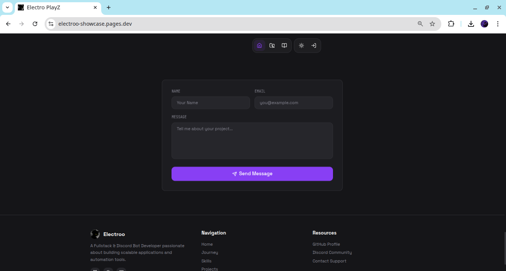
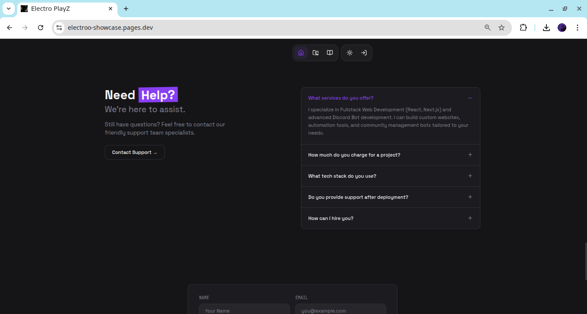
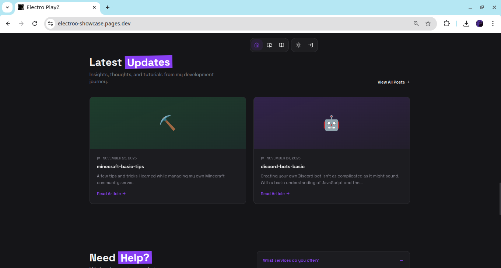
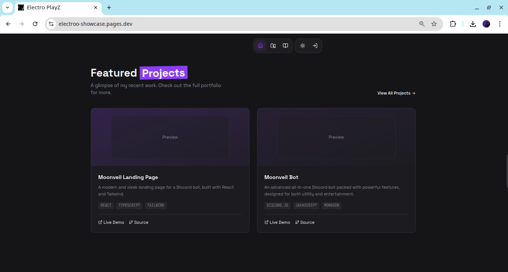
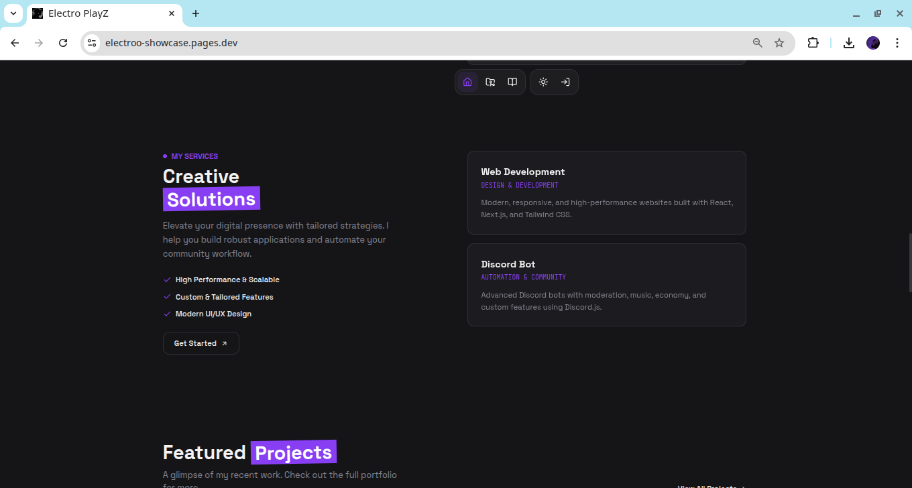
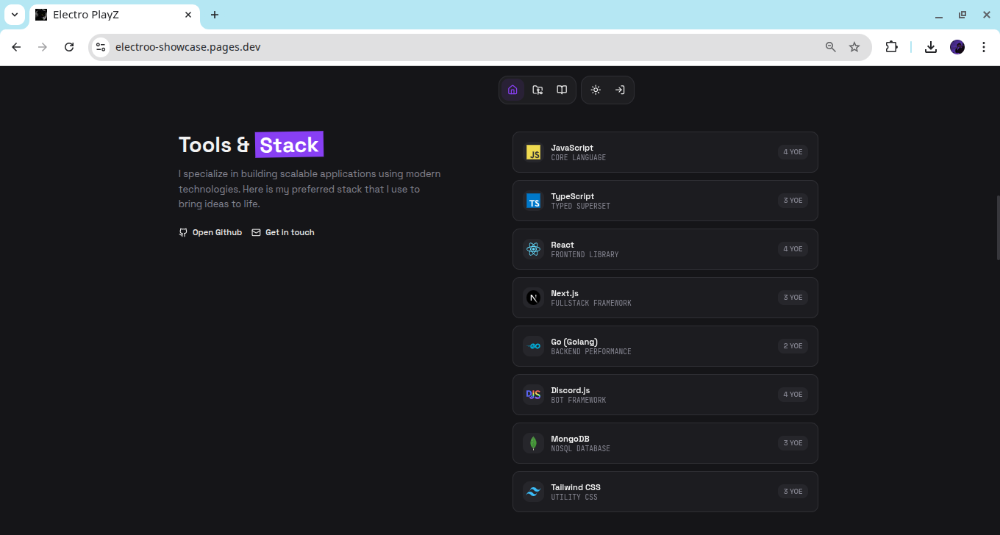
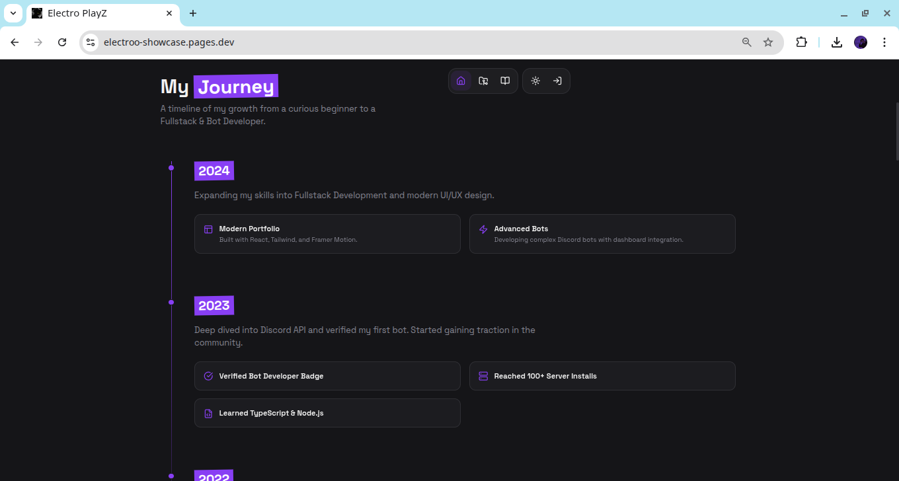
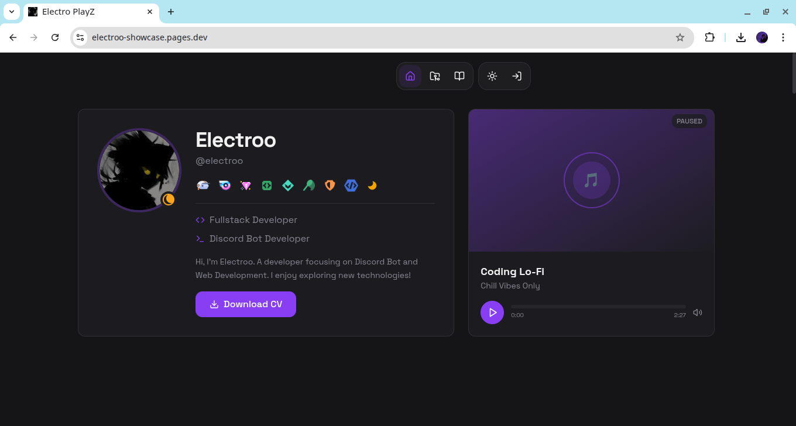

# Modern Responsive Portfolio Website

[](https://portfolio.electroo.space)  
[](LICENSE)

A **modern, responsive, and fast portfolio website** built with **React**, **TypeScript**, **Vite**, **Tailwind CSS**, and **Shadcn UI**. Perfect for showcasing projects, skills, and personal branding on any device.

---

## 🌟 Features

- ✅ Fully Responsive – Desktop, tablet, and mobile friendly  
- ✅ Lightning-fast – Powered by **Vite** and optimized for performance  
- ✅ TypeScript Support – Fully typed React components  
- ✅ Tailwind CSS & Shadcn UI – Modern, reusable UI components  
- ✅ SEO-Friendly – Optimized for search engines  
- ✅ Easy Deployment – Vercel, Netlify, Cloudflare Pages

---

## 🎨 Tech Stack


---

## 📸 Homepage Screenshots

Scroll horizontally to see the homepage from top to bottom:

<p align="center" style="overflow-x: auto; white-space: nowrap;">
  
  
  
  
  
  
  
  
</p>

> Tip: You can adjust `width` to make images bigger or smaller.

---

## 🚀 Live Preview

Check out the live portfolio: [https://portfolio.electroo.space](https://portfolio.electroo.space)

---

## 🛠️ Installation

### Using npm
```bash
git clone https://github.com/yourusername/your-portfolio.git
cd your-portfolio
npm install
npm run dev
```

### Using yarn
```bash
git clone https://github.com/yourusername/your-portfolio.git
cd your-portfolio
yarn install
yarn dev
```

### Using bun
```bash
git clone https://github.com/yourusername/your-portfolio.git
cd your-portfolio
bun install
bun run dev
```

Open [http://localhost:5173](http://localhost:5173) to view locally.

### Build for Production
```bash
npm run build
# or
yarn build
# or
bun run build
```

Production-ready files will be in the `dist/` folder.

---

## 📂 Folder Structure

```
├─ public/          # Static assets
├─ src/             # Source code
│  ├─ components/   # Reusable UI components
│  ├─ hooks/        # Custom React hooks
│  ├─ assets/       # Images, icons, screenshots
│  └─ App.tsx       # Root component
├─ package.json      # Project dependencies and scripts
├─ vite.config.ts    # Vite configuration
└─ tailwind.config.ts# Tailwind configuration
```

---

## 🤝 Contributing

1. Fork the repository  
2. Create a feature branch (`git checkout -b feature/awesome-feature`)  
3. Commit your changes (`git commit -m "Add awesome feature"`)  
4. Push to the branch (`git push origin feature/awesome-feature`)  
5. Open a Pull Request  

---

## 📄 License

MIT License – see the [LICENSE](LICENSE) file for details.

---

Made with ❤️ by [Electroo](https://electroo.space)
